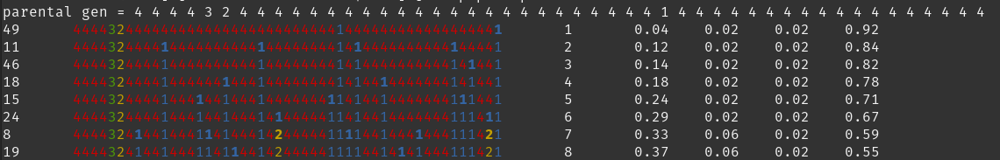

= POPMOD.pl

Simulates the evolution of a DNA sequence over generations based on simplified mutation rules.

== DESCRIPTION

This script simulates the evolutionary process of a DNA sequence by applying simplified mutation rules to a population represented by four types of elements (1-4), mimicking the nucleic acids in DNA (Adenine, Cytosine, Guanine, Thymine). The simulation runs for a specified number of generations, with each generation potentially introducing mutations based on predefined rules and random selection pressures.

== USAGE

perl popmod.pl [NUMBER OF GENERATIONS]

Prepare a file named "population.txt" containing the initial DNA sequence, where each character is a number from 1 to 4 representing a nucleotide. Run the script by providing the desired number of generations as a command-line argument.

Example:

    perl dna_evolution_simulator.pl 10

Output Columns:

    Selection Pressure (Pt Mutation)
    Population (Nuceotides)
    Generation
    Pct 1
    Pct 2
    Pct 3
    Pct 4

== FUNCTIONS

=== Main Program

The main program reads the initial DNA sequence, simulates the specified number of generations applying mutation rules, and prints the evolution of the sequence along with the final proportions of each nucleotide type.

=== Mutation Rules

- item * If a nucleotide is 1 and its previous neighbor was 1, it remains 1.

- item * If a nucleotide is 1 and its previous neighbor was not 1, it becomes 2.

- item * A nucleotide 2 always becomes 3.

- item * A nucleotide 3 always becomes 4.

- item * If a nucleotide is 4 and its previous neighbor was 3, it becomes 2.

- item * If a nucleotide is 4 and its previous neighbor was not 3, it becomes 1.

== FILES

- population.txt - The initial DNA sequence.

- generations_plot.txt - The file where population percentages are saved after each generation.

- popmod_fast.pl - A version that will run full speed.

- plotPop.sh - A bash script that will plot population in terminal. Uses gnuplot. To view over time, combine with watch as: 
    
    watch bash plotPops.sh 

== AUTHOR

Andy Richardson - This script was created as an educational tool to demonstrate basic principles of genetics and evolution through programming.

== LICENSE

This script is released under the MIT License.

